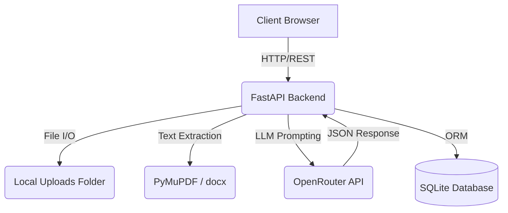

# Architecture Overview

## Overall System Architecture
Contract Insight Hub is a modern, full-stack web application designed for intelligent contract analysis. The system follows a decoupled Client-Server architecture where a React-based Single Page Application (SPA) communicates over HTTP via REST APIs with a Python FastAPI backend. The backend manages file processing, database persistence, and external communication with OpenRouter for Large Language Model (LLM) analysis.

## Frontend Architecture
The frontend is built for performance and type safety.
- **Framework:** React 19 bundled with Vite.
- **Routing:** TanStack Router is used for type-safe routing and file-based route generation.
- **State Management:** TanStack React Query manages server state, caching, and background data fetching.
- **UI Components:** The UI is constructed using TailwindCSS and Radix UI primitives (shadcn/ui style components) to ensure accessible, unstyled, and highly customizable UI elements.
- **Form Handling:** React Hook Form combined with Zod for robust client-side validation.

## Backend Architecture
The backend is designed for high-performance async processing and robust data validation.
- **Framework:** FastAPI provides automatic OpenAPI documentation and fast async request handling.
- **Database Layer:** SQLAlchemy is used as the ORM to interact with a local SQLite database (`contracts.db`), making deployment lightweight and self-contained.
- **Data Validation:** Pydantic schemas enforce type-safety for incoming requests and outgoing API responses.

## AI Integration
The application uses OpenRouter as a unified API gateway to interact with LLMs. By default, it targets the `tencent/hy3:free` model. The backend constructs a structured prompt combining the extracted text with a strict JSON schema, instructing the LLM to extract metadata, clauses, risks, and obligations directly into a predictable JSON structure.

## Data Flow & File Upload Workflow
1. **Upload:** The user drops a `.pdf`, `.docx`, or `.txt` file into the frontend dropzone.
2. **Transfer:** The file is POSTed to `/api/contracts/upload`.
3. **Storage:** The backend saves the file in bounded chunks to the local `uploads/` directory to prevent memory exhaustion.
4. **Extraction:** The backend reads the file and extracts text using PyMuPDF (for PDFs) or `python-docx` (for DOCX). Text is chunked into logical "pages".
5. **AI Processing:** The text is sent to OpenRouter. The backend intercepts the response, applies regex fallback mechanisms to extract the JSON from markdown fences, and parses the payload.
6. **Persistence:** The parsed structured data (Contract, Metadata, Parties, Clauses, Risks, Obligations, Executive Summary) is saved to the SQLite database via SQLAlchemy.
7. **Response:** A `201 Created` is returned to the frontend along with the generated `contract_id`.
8. **Navigation:** The frontend automatically navigates to the review dashboard, using React Query to fetch and display the newly saved contract data.

## Technologies Used
- **Frontend:** React, TypeScript, Vite, TanStack Router, TanStack Query, TailwindCSS, Radix UI.
- **Backend:** Python, FastAPI, SQLAlchemy, SQLite, Uvicorn, PyMuPDF, python-docx.
- **External Services:** OpenRouter API.

## Folder Structure (High Level)
- `backend/` - Contains all Python API code.
  - `main.py` - FastAPI application setup and routing.
  - `ai_service.py` - OpenRouter integration and JSON parsing.
  - `parser.py` - Document text extraction logic.
  - `models.py` / `schemas.py` - SQLAlchemy models and Pydantic validation.
  - `database.py` - DB connection setup.
- `src/` - Contains all frontend code.
  - `routes/` - TanStack file-based routes.
  - `components/` - Reusable UI components.
  - `hooks/` - Custom React Query hooks.
  - `lib/` - Utilities and API client configuration.
